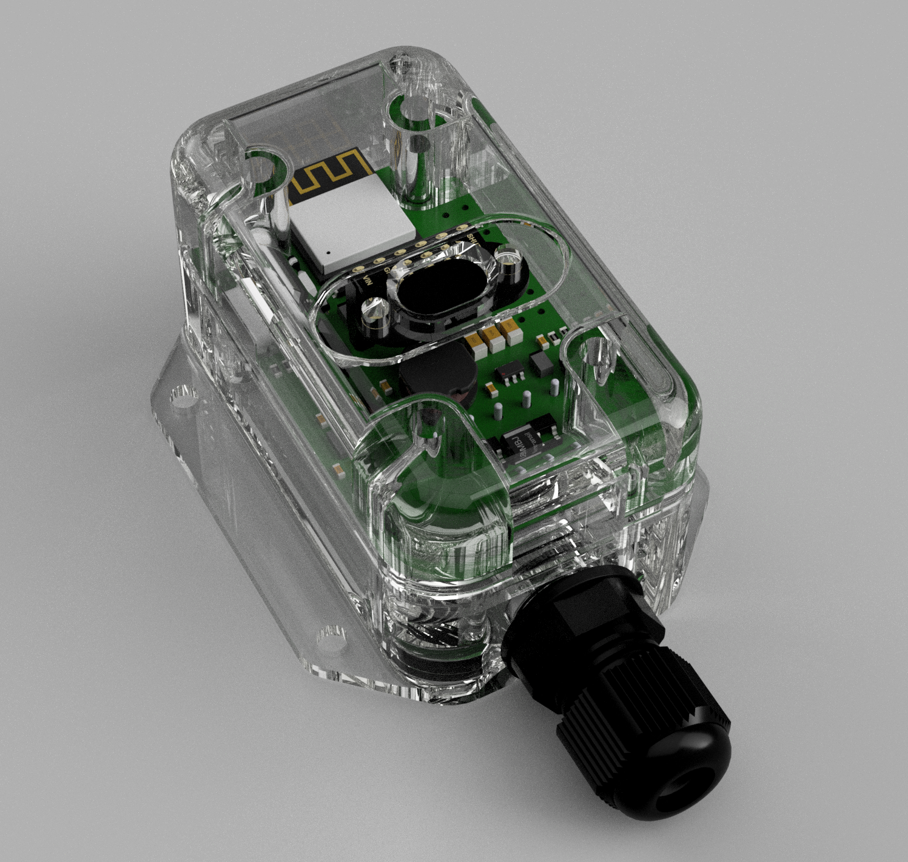

# ESP32-C6 Configurable Proximity Sensor

**Version 1.0.1** - A configurable proximity sensor system built with ESP32-C6, featuring real-time web-based monitoring, advanced adaptive filtering, and secure OTA firmware updates.

[](https://github.com/ScionResearch/tof-proximity-sensor/releases)



## Features

### **🎯 Core Functionality**

- **VL53L1X ToF Sensor** - Accurate distance measurement up to 4 meters
- **Advanced Adaptive Filtering** - Intelligent noise reduction with rapid adaptation to sustained changes
- **Variance-Based Noise Detection** - Automatic detection and filtering of noisy environments
- **Dual Configurable Outputs** - Independent range, hysteresis, and polarity control
- **Smart Fault Detection** - Distinguishes genuine sensor faults from normal out-of-range conditions
- **Automatic Recovery** - Self-healing sensor initialization with enhanced reliability
- **Rapid Response Fix** - Outputs properly reset when objects are quickly removed

### **🌐 Web Interface**

- **Real-time Monitoring** - 5Hz update rate for smooth feedback
- **Live Configuration** - Adjust ranges, hysteresis, and polarity without reprogramming
- **Individual Output Control** - Enable/disable each output independently
- **Password Authentication** - Secure access with configurable admin password
- **Dynamic Visual Feedback** - Color-coded status and output indicators
- **Mobile-Optimized Design** - Clean, touch-friendly interface for smartphones
- **iOS Compatibility** - Enhanced captive portal support for reliable iPhone/iPad access

### **🔄 Over-The-Air (OTA) Updates**

- **Secure Firmware Updates** - Upload new firmware directly through web interface
- **Multi-Layer Security** - File validation, size checks, and integrity verification
- **Visual Feedback** - Orange LED indication during firmware update process
- **Progress Monitoring** - Real-time upload progress with detailed status messages
- **Safe Recovery** - Automatic rollback on failed updates with device protection

### **🔧 Hardware Integration**

- **WS2812 RGB LED** - Enhanced visual status indication:
  - **Green**: Normal operation (pulsing effect)
  - **Blue**: Triggered state
  - **Red**: Sensor fault or error
  - **Orange**: Firmware update in progress
- **Two Digital Outputs** - Configurable trigger logic with hysteresis
- **Persistent Storage** - Configuration saved to LittleFS flash memory
- **Unique WiFi SSID** - MAC-based identifier for multi-sensor deployments (fixed in v1.0.0)
- **Enhanced Diagnostics** - Comprehensive serial logging for troubleshooting

## Hardware Requirements

### **Main Components**

- **ESP32-C6-Mini** development module
- **VL53L1X** Time-of-Flight distance sensor
- **WS2812** RGB LED (NeoPixel)
- **Custom PCB** with two digital output channels

## Quick Start Guide

### **1. First Boot**

1. Power on the device
2. Look for WiFi network: `ToF-Prox-XXXXXX` (where XXXXXX = last 3 bytes of MAC address)
3. Connect using password: `sensor123`

### **2. Web Interface Access**

1. Open browser and navigate to: `http://192.168.4.1`
2. Login with default credentials:
   - **Password:** `admin`

### **3. Initial Configuration**

1. **Change Admin Password** (recommended):

   - Scroll to "Change Password" section
   - Enter current password: `admin`
   - Set new password and confirm
   - Click "Change Password"
2. **Configure Outputs**:

   - Adjust ranges, hysteresis, and polarity as needed
   - Click "Save Configuration"

## Default Settings

### **Network Configuration**

- **WiFi SSID:** `ToF-Prox-XXXXXX` (unique per device)
- **WiFi Password:** `sensor123`
- **IP Address:** `192.168.4.1`
- **Web Interface:** `http://192.168.4.1`

### **Authentication**

- **Default Admin Password:** `admin`
- **Important:** Change the default password after first login!

## Changelog

### **Version 1.0.1** (Latest)

#### 🔧 **Bug Fixes**
- **Fixed Output Trigger Logic**: Outputs configured as "Active out of range" now properly trigger when sensor readings exceed maximum detection range
- **Improved Out-of-Range Handling**: Enhanced logic for handling sensor readings beyond physical detection limits

#### 📱 **Mobile Enhancements**
- **Smart Firmware Update Restriction**: Firmware update panel automatically hidden on smartphones to ensure updates are only performed from PCs
- **Mobile Device Detection**: JavaScript-based user agent detection prevents accidental firmware updates from mobile devices
- **Enhanced Mobile Layout**: Improved responsive design for better mobile user experience

#### 🎨 **UI/UX Improvements**
- **Professional Layout**: Implemented CSS Grid layout for perfect form field alignment across all sections
- **Consistent Status Cards**: Fixed status card height inconsistencies for better visual alignment
- **Responsive Design**: Enhanced mobile breakpoint handling with single-column layout on small screens
- **Visual Consistency**: Improved spacing, padding, and visual hierarchy throughout the interface

#### 🏢 **Branding**
- **Company Logo Integration**: Embedded BSI logo in header with professional dark background styling
- **Responsive Logo Sizing**: Logo scales appropriately across desktop and mobile devices
- **Enhanced Visual Identity**: Improved page aesthetics with proper logo placement and contrast

#### 🔧 **Technical Improvements**
- **Base64 Logo Embedding**: Optimized logo delivery with embedded encoding for faster loading
- **Improved CSS Architecture**: Better organized stylesheets with consistent naming conventions
- **Enhanced JavaScript**: More robust mobile detection and UI interaction handling

### **Version 1.0.0**
- Initial release with core proximity sensor functionality
- Web-based configuration interface
- OTA firmware update capability
- Advanced adaptive filtering
- Dual configurable outputs

### **Sensor Configuration**

- **Timing Budget:** 50ms
- **Adaptive Filtering:** Intelligent noise reduction with rapid adaptation
- **Variance Threshold:** Automatic noise detection and filtering
- **Update Rate:** 5Hz web interface refresh
- **Change Detection:** Sustained change detection for rapid adaptation

### **Output Defaults**

| Output | Enabled | Min Range | Max Range | Hysteresis | Polarity |
|--------|---------|-----------|-----------|------------|-----------|
| Output 1 | Disabled | 0mm | 100mm | 25mm | Active In Range |
| Output 2 | Disabled | 0mm | 100mm | 25mm | Active In Range |

### **Factory Reset**

- Connect a jumper from GND to the Factory Reset pin (pin 17).
- Power cycle or reset the device, leave the jumper in place until the LED turns green.
- All settings will be reset to default, including web admin password.

## Web Interface Guide

### **Status Monitoring**

- **Distance Display:** Shows actual distance in mm or "Out of range"
- **Status Panel:** Color-coded system status
  - 🟢 Green: Normal operation
  - 🔵 Blue: Output triggered
  - 🔴 Red: Sensor fault
- **Output Status:** Real-time ON/OFF indication with color feedback

### **Configuration Options**

#### **Output Settings**

- **Enable/Disable:** Individual control for each output
  - Unchecked = Output disabled (always OFF)
  - Checked = Output follows detection logic
- **Min/Max Distance:** Set detection range (0-2000mm)
- **Hysteresis:** Prevent output chatter (0-500mm)
- **Polarity:** 
  - "Active In Range" = Output ON when object is between Min-Max
  - "Active Out of Range" = Output ON when object is outside Min-Max

#### **Security Settings**

- **Change Password:** Update admin password with confirmation
- **Logout:** Secure session termination

## LED Status Indicators


| Color              | Status       | Description                         |
| -------------------- | -------------- | ------------------------------------- |
| 🟢**Green**        | Normal       | Sensor operating normally           |
| 🔵**Blue**         | Triggered    | Object detected in configured range |
| 🔴**Red Blinking** | Fault        | Sensor hardware fault detected      |
| 🟡**Yellow**       | Initializing | System startup in progress          |

## Technical Specifications

### **Sensor Performance**

- **Range:** 0mm to 2000mm (typical)
- **Accuracy:** ±3% of distance
- **Update Rate:** Up to 20Hz (50ms timing budget)
- **Field of View:** 27° (full width)

### **System Specifications**

- **Supply Voltage:** +12V-24V DC 100mA max
- **Microcontroller:** ESP32-C6 (160MHz, 320KB RAM, 4MB Flash)
- **WiFi:** 802.11 b/g/n (2.4GHz)
- **Operating Temperature:** -10°C to +60°C

### **Output Specifications**

- **Digital Outputs:** 2 channels open drain
- **Max Voltage at Outputs:** +33V DC
- **Current Capacity:** 100mA per output source capacity
- **Response Time:** <100ms (including hysteresis)

## Development Environment

### **PlatformIO Configuration**

```ini
[env:esp32-c6-devkitm-1]
platform = https://github.com/pioarduino/platform-espressif32/releases/download/54.03.20/platform-espressif32.zip
board = esp32-c6-devkitm-1
framework = arduino
build_flags = 
    -D ARDUINO_USB_MODE=1
    -D ARDUINO_USB_CDC_ON_BOOT=1
    -D ESP32_C6_env
lib_deps = 
    adafruit/Adafruit NeoPixel@^1.15.1
    adafruit/Adafruit VL53L1X@^3.1.2
    bblanchon/ArduinoJson@^7.0.4
    ESP32Async/AsyncTCP
    ESP32Async/ESPAsyncWebServer
```

### **Required Libraries**

- **Adafruit NeoPixel** - WS2812 LED control
- **Adafruit VL53L1X** - ToF sensor interface
- **ArduinoJson** - Configuration serialization
- **ESP32Async/AsyncTCP** - Async networking (ESP32-C6 compatible)
- **ESP32Async/ESPAsyncWebServer** - Web server framework

## Troubleshooting

### **Common Issues**

#### **Cannot Connect to WiFi**

- Verify SSID format: `ToF-Prox-XXXXXX`
- Check password: `sensor123`
- Ensure device is powered and LED is active
- Try power cycling the device

#### **Web Interface Not Loading**

- Confirm connection to correct WiFi network
- Navigate to: `http://192.168.4.1` (not https)
- Clear browser cache if needed
- Try different browser

#### **Sensor Shows "Out of range"**

- Normal when no object is within detection range (0mm-2000mm)
- Check sensor alignment and cleanliness
- Verify object is within sensor field of view (27°)

#### **Outputs Not Triggering**
- **Check if outputs are enabled** - Both outputs are disabled by default for safety
- Verify configuration ranges are appropriate for your application
- Check hysteresis settings (too high may prevent triggering)
- Confirm polarity setting matches your requirements
- Test with known object at specific distance

#### **Red LED (Fault Condition)**

- Power cycle the device (automatic recovery attempts every 5 seconds)
- Check I2C connections to VL53L1X sensor
- Verify sensor is not obstructed or damaged

## Multi-Sensor Deployment

### **Network Planning**

- Each sensor creates unique SSID based on MAC address
- No network conflicts when multiple sensors are deployed
- Individual configuration and monitoring per sensor
- Suitable for industrial and commercial installations

### **Identification**

- SSID format: `ToF-Prox-XXXXXX`
- Serial monitor shows actual SSID during startup
- MAC address visible in device information

## Applications

### **Industrial Automation**

- Conveyor belt object detection
- Material level sensing
- Robotic positioning feedback
- Quality control measurements

### **Security Systems**

- Perimeter detection
- Access control triggers
- Intrusion detection
- Vehicle presence sensing

### **Smart Building**

- Occupancy detection
- Automatic door control
- Parking space monitoring
- Energy management triggers

## Changelog

### **Version 1.0.0** - *August 2025*

#### 🚀 **Major Features**

- **Over-The-Air (OTA) Firmware Updates**
  - Secure web-based firmware upload interface
  - Multi-layer security validation (file type, size, integrity)
  - Visual feedback with orange LED during updates
  - Real-time progress monitoring
  - Automatic rollback on failed updates

- **Advanced Adaptive Filtering System**
  - Replaced simple moving average with intelligent adaptive filter
  - Variance-based noise detection and filtering
  - Rapid adaptation to sustained changes while filtering noise
  - Configurable thresholds for different environments
  - Enhanced signal quality assessment

#### 🔧 **Improvements**

- **Fixed SSID Uniqueness Issue**
  - Resolved static MAC address problem in WiFi AP mode
  - Each device now generates truly unique SSID based on hardware MAC
  - Proper WiFi initialization sequence ensures correct MAC retrieval

- **Enhanced Output Trigger Logic**
  - Fixed output lock-up when objects are quickly removed
  - Outputs now properly reset when sensor goes out of range
  - Improved hysteresis handling for rapid distance changes
  - Added comprehensive debug logging for troubleshooting

- **LED Status Enhancements**
  - Added orange LED indication during firmware updates
  - Enhanced pulsing effects for normal operation
  - Improved visual feedback for all system states

#### 🛡️ **Security & Reliability**

- **Firmware Validation**
  - File extension validation (only .bin files accepted)
  - Size validation (minimum/maximum limits)
  - Free space verification before update
  - ESP32 built-in checksum verification

- **Enhanced Error Handling**
  - Improved sensor fault detection and recovery
  - Better distinction between genuine faults and out-of-range conditions
  - Automatic sensor reinitialization on communication errors

#### 📱 **Web Interface Updates**

- **OTA Update Section**
  - Dedicated firmware update interface
  - Current version and build date display
  - Security warnings and user guidance
  - Progress indicators and status messages

- **Enhanced Diagnostics**
  - Real-time variance and noise level display
  - Adaptive filter status indicators
  - Comprehensive system information

#### 🔧 **Technical Improvements**

- **Code Organization**
  - Modular filter classes (NoiseFilter, AdaptiveFilter)
  - Improved separation of concerns
  - Enhanced maintainability and extensibility

- **Performance Optimizations**
  - Reduced memory usage in filtering algorithms
  - Optimized sensor reading processing
  - Improved web interface responsiveness

#### 📋 **Configuration**

- **Version Information**
  - Added FW_VERSION constant (1.0.0)
  - Version display in web interface
  - Build date tracking

---

## License

This project is open source. Please refer to the LICENSE file for details.

## Contributing

Contributions are welcome! Please feel free to submit pull requests or open issues for bugs and feature requests.

## Support

For technical support or questions:

1. Check this README for common solutions
2. Review the troubleshooting section
3. Open an issue on GitHub with detailed description
4. Include serial monitor output when reporting bugs

---

**⚠️ Security Note:** Always change the default admin password (`admin`) after first login to secure your device!

**📝 Note:** This sensor is designed for indoor use. For outdoor applications, ensure appropriate weatherproofing of the electronics.
